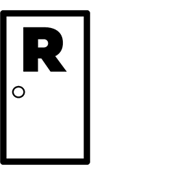
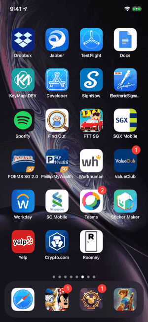

# Welcome to Roomey App

## App Logo

 

## App Demo
<left></left>

## Pre-requisites

1. macOS 10.15 or later
2. Xcode 11.5 or later
3. Carthage 0.34.0 or later Installed ([Setup guide here](https://github.com/Carthage/Carthage))
4. Valid Apple Developer Account signed-in in Xcode

## Clone the project

1. Perform `git clone https://github.com/lawreyios/govtech-roomey.git` from your **Terminal**.
2. Go into the root directory with `cd govtech-roomey/Roomey`.
3. Run `carthage bootstrap --platform iOS` to install dependencies.

## Run the app

1. Open **Roomey.xcodeproj** with Xcode.
2. Ensure **Scheme** is at **Roomey-DEV**.
3. If you are running on **Simulator**, you have to upload an image to simulate hard-coded data, else you can connect your **real iOS device** or iOS 13.5 and above to run the native QR Code Scanner.
3. Run the app with **►**.

## Run the app's test suite

1. Open **Roomey.xcodeproj** with Xcode.
2. Ensure **Scheme** is at **Roomey-DEV**.
3. Go to **Product -> Test** or **⌘U** to run the tests.
